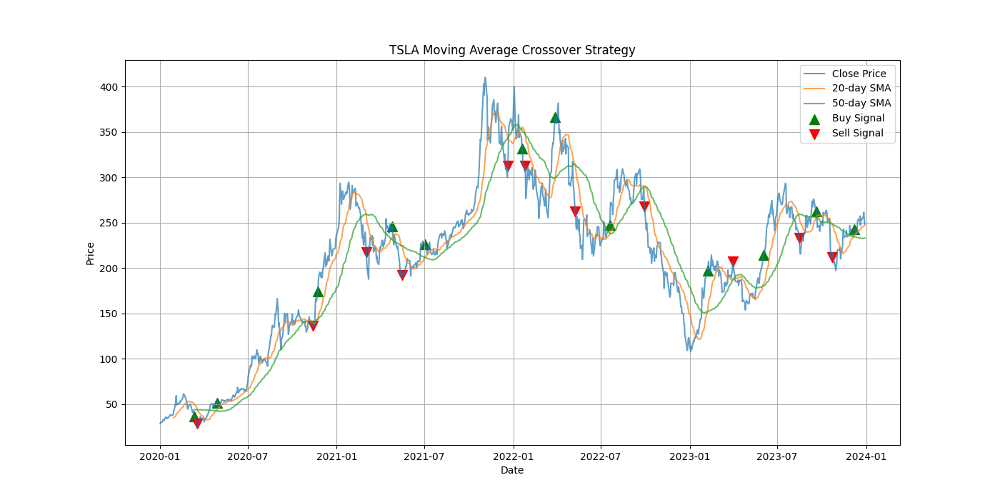

# Moving Average Crossover Trading Strategy

A simple yet effective backtesting project that simulates a **Moving Average Crossover Trading Strategy** using Python and historical stock data.  
The project demonstrates key concepts in **quantitative trading**, **data handling**, and **algorithmic strategy evaluation** — highly relevant for quantitative finance roles.

---

## **Overview**
This project uses two moving averages:
- **Short-Term SMA (20-day)**  
- **Long-Term SMA (50-day)**  

**Buy Signal:**  
When the short-term SMA crosses **above** the long-term SMA → indicates bullish momentum.

**Sell Signal:**  
When the short-term SMA crosses **below** the long-term SMA → indicates bearish momentum.

The strategy is then backtested on historical stock data to evaluate performance.

---

## 📈 Strategy Performance
| Metric              | Value                |
|---------------------|----------------------|
| **Date Range Tested** | 2020-01-01 to 2024-01-01 |
| **Ticker**          | TSLA (Tesla Inc.) |
| **Short-Term SMA**  | 20 days |
| **Long-Term SMA**   | 50 days |
| **Final Cumulative Return** | **+94.75%** |

> The strategy nearly **doubled the portfolio** in the 4-year period by capturing long-term trends.

Example output chart:

  
*Green triangles = Buy signals, Red triangles = Sell signals*

---

## **Tech Stack**
- **Python 3.9+**
- **Libraries:**
  - `pandas` → Data manipulation  
  - `matplotlib` → Visualization  
  - `yfinance` → Fetch historical market data

---

## **Installation Guide**

### **1. Clone the Repository**
```bash
git clone https://github.com/<your-username>/moving_average_strategy.git
cd moving_average_strategy
```

### **2. Create a Virtual Environment (Optional but Recommended)**
```bash
python3 -m venv venv
source venv/bin/activate   # Mac/Linux
venv\Scripts\activate      # Windows
```

### **3. Install Packages**
```bash
pip install -r requirements.txt
```

---

## **How to Run the Project**
```bash
python main.py
```
When you run the script:
- A **graph** will appear showing:
  - Stock Price 
  - Short-term and Long-term SMAs
  - Buy/Sell signals
  
- The **final cumulative return** will be printed in the terminal.  

Example:
```bash
Cumulative Returns: 94.75%
```

---

## **Project Structure**
```bash
moving_average_strategy/
|
|-- main.py                   #Core
strategy logic and backtesting
|-- requirements.txt          #Required
Python libraries
|__ README.md                 # Project
documentation
```

---

## **Example Use Cases**
- Learn the basics of **algorithmic trading**.  
- Demonstrate **quantitative skills** for internships or job applications.  
- Extend this into more advanced strategies such as:
  - Risk management with stop loss.
  - Multiple asset backtesting.
  - Machine learning for signal generation.

---

## **Author**
Developed by **ANANT RAJ**. 